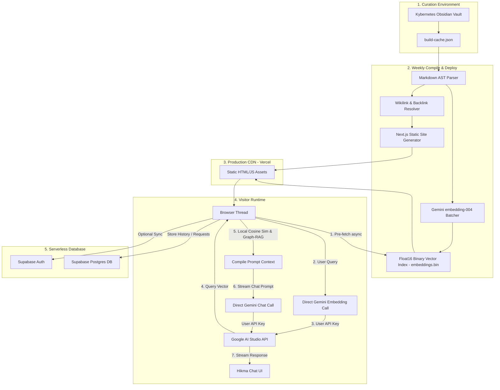

# Maktaba Architecture Specification
### *System Design Blueprint for the Living Library & Hikma Companion*

---

## 1. System Overview

Maktaba is a public-facing, highly performant living library built on the **Kybernetes** personal Obsidian knowledge vault. It is designed to expose over 660,000 words across interconnected notes spanning Computer Science, Mathematics, Philosophy, History, and Islamic Jurisprudence. 

The architecture is built on a **fully static frontend (Next.js SSG)** combined with a **client-side vector search retrieval model (Graph-RAG)** and a **serverless database backend (Supabase)** for optional authentication, search telemetry, and note requests.



---

## 2. The Content Pipeline (Vault $\rightarrow$ Static Site)

To compile the Markdown files from the local directory `~/Kybernetes` into web assets, a custom build script runs on a **weekly deployment cycle** (triggered via scheduled cron jobs in GitHub Actions).

### 2.1 Directory Exclusions & Boundaries
The parser scans `~/Kybernetes` but explicitly ignores private logistics and system configuration folders:
* **Excluded Folders:** `00_Inbox`, `60_Planner`, `90_System`, `.git`, `.obsidian`, and any course logistics (e.g., `10_University/Admin`).
* **Metadata Boundary:** If any Markdown file contains `private: true` or `draft: true` in its YAML frontmatter, the parser immediately discards it from compilation.

### 2.2 Wikilink & Link Resolution
Obsidian wikilinks (`[[Note_Name]]` or `[[Note_Name|Display Alias]]`) are processed at compile time:
* **Slug Map Generation:** The pipeline builds a bidirectional lookup map of `File Name -> URL Slug` for all public notes.
* **Unresolved Link Stripping:** If a wikilink points to an excluded/private folder or a missing note, the link wrapper is stripped. 
  * `[[Private_Note|Alias]]` becomes the plain text: `"Alias"`.
  * `[[Private_Note]]` becomes the clean plain text: `"Private Note"`.
* **Resolved Links:** Valid links are compiled to standard HTML `<Link>` elements pointing to the resolved slug.

### 2.3 Pre-Computed Bidirectional Backlinks
At build time, the pipeline analyzes all outgoing links for every public note. It constructs a reverse mapping to identify backlinks (incoming links). 
* The backlinks list (containing note titles, summaries, and URL slugs) is appended as a metadata array to each statically generated note page.
* These are displayed in a **Backlinks Section** at the bottom of the note reader.

### 2.4 Incremental Build Cache
To avoid re-processing 360+ notes (exceeding 560k words) on every deployment:
* The pipeline maintains a `build-cache.json` containing the MD5 hashes of all Markdown files.
* During the build run, only files with changed MD5 hashes undergo parsing and vector re-embedding.
* Unchanged notes reuse their pre-compiled HTML and vector chunks directly, saving API tokens.

---

## 3. Hierarchical Graph-RAG & Semantic Retrieval

To avoid running a costly server-side vector database, Maktaba implements a **client-side hierarchical vector search** powered by the visitor's own API key.

### 3.1 AST Section Parsing & Context Prepending
Naive chunking breaks code blocks and mathematical equations. Maktaba parses files into an **Abstract Syntax Tree (AST)** using Markdown headers (`#`, `##`, `###`):
1. Notes are segmented into logical sections based on headers.
2. For each section, a semantic context breadcrumb is prepended to the text before embedding.
   * *Example:* If the note is `Virtual_Memory` and the section is under `### LRU Approximation`, the text to embed is:
     `"Virtual Memory > Page Replacement Algorithms > LRU Approximation: [Text Content]"`
3. This preserves structural hierarchy within the embedding vector.

### 3.2 Float16 Binary Vector Index (`embeddings.bin`)
To minimize the download payload on initial page load:
* Embeddings generated via Google's `text-embedding-004` (768-dimensions) are converted from standard `float32` (4 bytes) to `float16` (2 bytes).
* The chunk structure, vectors, and parent-note metadata are packed into a single binary file (`embeddings.bin`).
* For 1,900 parsed chunks, the raw index file size is exactly **2.9 MB** (highly compressible to $<2.0 \text{ MB}$ under gzip/brotli).

### 3.3 Runtime Retrieval & The Threshold Algorithm
When a query is entered into the Hikma Companion chat interface:
1. **Query Vectorization:** The browser requests a vector for the query by calling Google's Embedding API directly using the visitor's locally stored API key.
2. **Local Similarity Math:** In JS, a quick Cosine Similarity is calculated between the query vector and the pre-loaded `embeddings.bin` typed array.
3. **Threshold-Based Filtering:**
   * We apply a cosine similarity threshold $T = 0.70$. All sections scoring below this are discarded.
   * If no section matches, Hikma skips retrieval and gracefully prompts the user to request a note.
4. **Group and Select Top 3:**
   * The remaining matching sections are grouped by their parent note.
   * The system selects up to the **top 3 notes** containing the highest-scoring sections.
   * This prevents single long notes from monopolizing the context window.
5. **Prompt Assembly:** The text content of the selected sections, including their hierarchical breadcrumbs, is structured into a chat context prompt and streamed to the Gemini chat model.

---

## 4. Frontend & UI Architecture

Maktaba prioritizes a premium, high-speed user experience with a unified Single Page Application (SPA) feel.

### 4.1 Technology Stack
* **Framework:** Next.js (SSG mode using `output: 'export'`) to pre-render every note into semantic HTML for perfect SEO and near-instant load speeds.
* **Component Library:** React for the UI shell, markdown parser, and interactive components.
* **Styling:** CSS Modules / Vanilla CSS to create a tailored, low-weight, responsive theme.

### 4.2 "Night Sky" Graph Visualizer
* **Library:** `react-force-graph-2d` utilizing HTML5 Canvas (instead of SVG) to handle 360+ nodes and thousands of connections smoothly on mobile.
* **Physics Simulation Cooldown:** To prevent continuous battery drain on mobile devices, the D3 force simulation is heated only on load, runs for a maximum of 2-3 seconds to settle nodes, and then permanently freezes. Physics only re-heats temporarily during active user drag/zoom gestures.
* **Aesthetics:** Nodes are color-coded based on the primary domain tags parsed from note frontmatter:
  * `#field/cs` $\rightarrow$ Neon Blue
  * `#field/math` $\rightarrow$ Vivid Orange
  * `#field/humanities` $\rightarrow$ Emerald Green
  * `#subject/ai` $\rightarrow$ Cyber Pink
  * `#type/map` (T.O.C Backbone) $\rightarrow$ Pure White

### 4.3 Client-Side Optimization (Pre-fetching)
* The client browser does not wait for the visitor to click the Hikma Companion button to load search data.
* As soon as the page is idle (using `requestIdleCallback`), the browser downloads `embeddings.bin` and caches it locally. This hides download latency, enabling immediate search responsiveness when the user interacts with Hikma.

---

## 5. Backend, Database & Security

Authentication and data storage use a hybrid, low-maintenance serverless structure.

```markdown
| State | Storage Location | Sync Target | Available Features |
| :--- | :--- | :--- | :--- |
| **Guest User** | Local Browser Storage | None | Browse notes, read vault, session chat, local settings |
| **Signed-In User** | Local + Cloud DB | Supabase | History sync across devices, persist presets, Request a Note |
```

### 5.1 Supabase Integration
* **Database & Auth:** Supabase (free tier) handles user registrations, Google/GitHub OAuth logins, user profile settings, and persistent chat logs.
* **Row Level Security (RLS):** Policies are enforced at the database level to ensure data integrity:
  ```sql
  create policy "Users can only select their own data"
  on chat_logs for select
  using (auth.uid() = user_id);
  ```
  Users can only read, write, or delete rows belonging to their verified UID.

### 5.2 Visitor API Key Transparency
To ensure absolute transparency and verify that visitor keys are never intercepted:
1. The codebase is fully open-source.
2. The browser calls Google's API endpoints (`generativeai.googleapis.com`) directly. The Supabase backend never handles, routes, or stores the API key.
3. The API key is stored locally in the browser’s `localStorage` and vanishes automatically when the tab is closed, unless the user toggles "Persist Key on this Device".

### 5.3 Guest-to-User Sync Flow
When an anonymous guest decides to sign up/sign in:
1. The frontend checks if there are active chats in `localStorage`.
2. It displays a sync modal: *"Would you like to sync your current session chats to your account?"*
3. If confirmed, the browser pushes the local messages to the Supabase database under the user's new UID and clears the local cache.

### 5.4 Note Submissions Workflow
Topics submitted via the "Request a Note" form are:
* Written directly to a secure `note_requests` table in Supabase (available only to authenticated users).
* Optionally, a database trigger calls a serverless webhook to notify the curator via a private Discord or Telegram channel when a new request is submitted.
