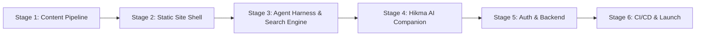
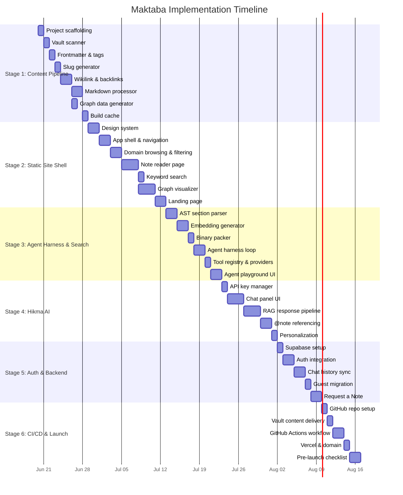

# Maktaba Implementation Plan
### *Multi-Stage Build Roadmap — From Empty Repo to Living Library*

---

## How to Read This Plan

The project is divided into **6 Stages**. Each stage is a self-contained milestone that produces a working, testable deliverable. Stages are sequential — each depends on the output of the previous one.

Within each stage, work is broken into **Phases**. Phases are atomic, independent units of work that can be completed in a single focused session. Each phase lists its exact inputs, outputs, and acceptance criteria so nothing is left to assumption.



---

## Vault Data Profile (Reference)

These numbers were measured directly from `~/Kybernetes` and inform every sizing decision in this plan.

| Metric | Value |
| :--- | :--- |
| Total public-eligible Markdown files | 361 |
| Files in `10_University` | 268 |
| Files in `20_CS_Core` | 53 |
| Files in `30_Knowledge_Base` | 123 |
| Files in `40_Projects` | 10 |
| Files in `50_Resources` | 11 |
| Total words | 567,837 |
| Median note length | 668 words |
| Max note length | 38,089 words |
| Files with YAML frontmatter | 407 / 455 |
| Files without frontmatter | 48 |
| Files with LaTeX expressions | 111 |
| Files with fenced code blocks | 164 |
| Files with embedded images | 2 (negligible) |
| Total wikilink occurrences | 959 |
| Unique wikilink targets | 543 |
| H1 headers across all files | 702 |
| H2 headers across all files | 3,041 |
| H3 headers across all files | 1,403 |
| H4 headers across all files | 206 |
| Estimated AST sections (H2+H3+H4) | ~4,650 |

---

# Stage 1: The Content Pipeline

**Goal:** Build the Node.js build script that reads the raw Kybernetes vault and produces a clean, structured JSON content layer that the frontend will consume. No UI work happens here. This stage outputs data files only.

**Deliverable:** A `scripts/build-content.ts` pipeline that, when run, produces a `content/` directory containing all processed note data, a graph edge list, and a slug lookup map.

---

### Phase 1.1 — Project Scaffolding & Tooling

**What:** Initialize the Maktaba repository with Next.js, TypeScript, and the build script skeleton.

**Steps:**
1. Initialize a Next.js project in `~/Maktaba` using `npx create-next-app@latest ./ --typescript --eslint --app --src-dir --no-tailwind --import-alias "@/*"`.
2. Create the following directory structure:
   ```
   ~/Maktaba/
   ├── docs/                          # Already exists (architecture, spec, this plan)
   ├── scripts/                       # Build pipeline scripts
   │   ├── build-content.ts           # Main pipeline entrypoint
   │   ├── parsers/                   # Markdown & wikilink parsers
   │   └── utils/                     # Hashing, file I/O helpers
   ├── content/                       # Generated output (gitignored)
   │   ├── notes/                     # Individual note JSON files
   │   ├── graph.json                 # Node + edge list for the graph visualizer
   │   ├── slug-map.json              # filename -> URL slug lookup
   │   └── tag-index.json             # Tag -> note list for filtering
   ├── src/
   │   ├── app/                       # Next.js App Router pages
   │   ├── components/                # React components
   │   ├── lib/                       # Shared utilities, types, constants
   │   └── styles/                    # CSS Modules
   └── public/                        # Static assets
   ```
3. Install dev dependencies: `tsx` (to run TypeScript build scripts), `gray-matter` (YAML frontmatter parser), `unified`/`remark` ecosystem (Markdown AST parser), `crypto` (for MD5 hashing — built-in Node).
4. Add a `package.json` script: `"build:content": "tsx scripts/build-content.ts"`.

**Inputs:** Empty `~/Maktaba` repo with `docs/` folder.
**Outputs:** Scaffolded Next.js project. Running `npm run build:content` executes without error (produces empty output).
**Acceptance:** `npm run dev` starts the Next.js dev server. `npm run build:content` runs and exits cleanly.

---

### Phase 1.2 — Vault Scanner & Directory Filter

**What:** Build the module that walks `~/Kybernetes`, applies exclusion rules, and returns a list of all public-eligible Markdown file paths.

**Steps:**
1. Create `scripts/parsers/vault-scanner.ts`.
2. Implement recursive directory walk starting from a configurable `VAULT_PATH` (default: `~/Kybernetes`).
3. Hard-exclude these directories (never scan their contents):
   - `00_Inbox`, `60_Planner`, `90_System`, `.git`, `.obsidian`, `.agents`, `youtube-to-docs-artifacts`
4. Hard-exclude `University_Admin` within `10_University`.
5. Exclude all non-`.md` files (`.zip`, `.ipynb`, `.py`, `.txt`, `.pptx`).
6. Exclude all files whose name starts with `T.O.C` — these are structural navigation files, not content notes.
7. Exclude root-level meta files: `GEMINI.md`, `AGENTS.md`, `T.O.C (Root).md`.
8. For each remaining `.md` file, read the YAML frontmatter. If `private: true` or `draft: true` is present, exclude it.
9. Return an array of `{ absolutePath, relativePath, filename }` objects.

**Inputs:** `~/Kybernetes` directory on disk.
**Outputs:** A filtered list of ~361 file paths.
**Acceptance:** Running the scanner outputs a count of files. No excluded directories or T.O.C files appear in the output.

---

### Phase 1.3 — Frontmatter Extractor & Tag Indexer

**What:** Parse the YAML frontmatter from every eligible note and build a structured tag index.

**Steps:**
1. Create `scripts/parsers/frontmatter-extractor.ts`.
2. For each file from Phase 1.2, use `gray-matter` to extract frontmatter fields.
3. Extract and normalize the following fields:
   - `tags`: Array of strings (e.g., `["field/cs", "subject/ai", "concept/search-heuristic"]`). Notes without tags get an empty array.
   - `title`: Use the frontmatter `title` field if present. If absent, derive from the filename by replacing underscores/hyphens with spaces and stripping the `.md` extension. For university notes with the `X.Y.Z - Title.md` pattern, extract only the title portion after the ` - `.
4. Build a `tag-index.json`:
   ```json
   {
     "field/cs": ["slug-1", "slug-2"],
     "subject/ai": ["slug-1", "slug-3"],
     "concept/search-heuristic": ["slug-1"]
   }
   ```
5. For the 48 files that lack frontmatter entirely, infer the `field` tag from their parent directory:
   - Files under `10_University/Semester_XX/{Subject}/` → infer `field/cs` (since all current university subjects are CS).
   - Files under `20_CS_Core/` → `field/cs`.
   - Files under `30_Knowledge_Base/` → attempt to infer from subdirectory name (e.g., `Fiqh` → `field/humanities`).
   - Files under `40_Projects/` → `field/cs`.
   - Files under `50_Resources/` → leave tags empty.

**Inputs:** File list from Phase 1.2, raw `.md` files on disk.
**Outputs:** `content/tag-index.json`. Each note object now carries a `tags` array and a resolved `title`.
**Acceptance:** Every note has a non-empty `title`. The tag index contains at least the `field/cs`, `field/humanities`, and `field/math` groups.

---

### Phase 1.4 — Slug Generator & Slug Map

**What:** Generate a unique, URL-safe slug for every note and produce the bidirectional lookup map used for wikilink resolution.

**Steps:**
1. Create `scripts/utils/slug-generator.ts`.
2. Slug rules:
   - Lowercase the title.
   - Replace spaces and underscores with hyphens.
   - Strip all non-alphanumeric characters except hyphens.
   - Collapse consecutive hyphens.
   - For university notes (`1.1.1 - Defining Intelligence`), the slug is derived from the title portion only: `defining-intelligence`.
3. Handle collisions: If two notes produce the same slug, append the parent folder name as a prefix (e.g., `coal-defining-intelligence` vs `ai-defining-intelligence`).
4. Build `content/slug-map.json`:
   ```json
   {
     "byFilename": {
       "Virtual_Memory": "virtual-memory",
       "1.1.1 - Defining Intelligence": "defining-intelligence"
     },
     "bySlug": {
       "virtual-memory": {
         "filename": "Virtual_Memory",
         "relativePath": "20_CS_Core/Theory/Virtual_Memory.md"
       }
     }
   }
   ```

**Inputs:** Note list with titles from Phase 1.3.
**Outputs:** `content/slug-map.json` with bidirectional lookup.
**Acceptance:** Every note has a unique slug. No two notes share the same slug. All slugs are URL-safe (no spaces, no special characters).

---

### Phase 1.5 — Wikilink Parser & Backlink Computer

**What:** Parse all `[[wikilinks]]` in every note, resolve them against the slug map, strip unresolvable links, and compute bidirectional backlinks.

**Steps:**
1. Create `scripts/parsers/wikilink-resolver.ts`.
2. Regex to match all Obsidian wikilink patterns:
   - `[[Note Name]]` — simple link.
   - `[[Note Name|Display Text]]` — aliased link.
   - `[[Note Name#Section]]` — section link (resolve to the note, ignore the section anchor for now).
   - `[[Note Name#Section|Display Text]]` — aliased section link.
   - `![[Embedded File]]` — embedded content (strip entirely — we don't support transclusion on the web).
3. For each wikilink:
   - Extract the target filename (the part before `|` or `#`).
   - Look it up in `slug-map.json`.
   - If found: replace the wikilink syntax with a markdown link `[Display Text](/notes/slug)`.
   - If not found (private, excluded, or non-existent): replace the entire wikilink with plain text. Use the display alias if present, otherwise use the target filename with underscores replaced by spaces.
4. Build a `backlinks` map:
   ```json
   {
     "virtual-memory": [
       { "slug": "page-replacement", "title": "Page Replacement" },
       { "slug": "os-overview", "title": "Operating Systems Overview" }
     ]
   }
   ```
   For each note A that links to note B, add A to B's backlinks array.

**Inputs:** Raw markdown content of all notes, `slug-map.json` from Phase 1.4.
**Outputs:** Processed markdown (wikilinks replaced), `backlinks` map attached to each note.
**Acceptance:** No raw `[[...]]` syntax remains in any processed markdown. Every resolved link points to a valid slug. Backlinks are symmetric (if A links to B, A appears in B's backlinks).

---

### Phase 1.6 — Markdown Body Processor

**What:** Convert the processed Markdown body (after wikilink resolution) into an HTML string ready for rendering, with LaTeX and code block support.

**Steps:**
1. Create `scripts/parsers/markdown-processor.ts`.
2. Use the `unified` + `remark-parse` + `remark-rehype` + `rehype-stringify` pipeline.
3. Add plugins:
   - `remark-math` + `rehype-katex` — for inline `$...$` and block `$$...$$` LaTeX rendering (affects 111 files).
   - `rehype-highlight` or `rehype-shiki` — for fenced code block syntax highlighting (affects 164 files).
   - `remark-gfm` — for GitHub Flavored Markdown (tables, strikethrough, task lists).
4. For each note, produce:
   ```json
   {
     "slug": "virtual-memory",
     "title": "Virtual Memory",
     "tags": ["field/cs", "subject/os", "concept/paging"],
     "htmlContent": "<article>...</article>",
     "rawMarkdown": "# Virtual Memory\n...",
     "wordCount": 2450,
     "backlinks": [{ "slug": "...", "title": "..." }],
     "relativePath": "20_CS_Core/Theory/Virtual_Memory.md"
   }
   ```
5. Write each note as an individual JSON file: `content/notes/{slug}.json`.

**Inputs:** Wikilink-resolved markdown from Phase 1.5, tag data from Phase 1.3.
**Outputs:** `content/notes/*.json` — one JSON file per note.
**Acceptance:** HTML renders correctly when injected into a `<div>`. LaTeX expressions produce valid KaTeX output. Code blocks have syntax highlighting classes applied.

---

### Phase 1.7 — Graph Data Generator

**What:** Produce the node and edge data for the interactive graph visualizer.

**Steps:**
1. Create `scripts/build-graph.ts`.
2. **Nodes:** One node per public note. Each node contains:
   ```json
   {
     "id": "virtual-memory",
     "title": "Virtual Memory",
     "field": "cs",
     "linkCount": 7
   }
   ```
   - `field` is extracted from the first `field/*` tag in the note's frontmatter. Used for color mapping.
   - `linkCount` is the total number of resolved outgoing + incoming links. Used for node brightness/size.
3. **Edges:** One edge per resolved wikilink between two public notes:
   ```json
   { "source": "virtual-memory", "target": "page-replacement" }
   ```
   Deduplicate: if A links to B and B links to A, produce only one edge.
4. Write `content/graph.json`:
   ```json
   {
     "nodes": [...],
     "edges": [...]
   }
   ```

**Inputs:** Slug map, resolved wikilinks, tag data.
**Outputs:** `content/graph.json`.
**Acceptance:** Every node ID matches a valid slug in `slug-map.json`. No edges reference non-existent nodes. No duplicate edges.

---

### Phase 1.8 — Incremental Build Cache

**What:** Implement the MD5-based caching layer so subsequent builds only re-process changed files.

**Steps:**
1. Create `scripts/utils/build-cache.ts`.
2. On each build run:
   - Compute the MD5 hash of every eligible `.md` file's raw content.
   - Compare against `content/build-cache.json` (a map of `relativePath -> md5Hash`).
   - If a file's hash is unchanged, skip parsing and reuse the existing `content/notes/{slug}.json`.
   - If a file is new or changed, re-parse it through Phases 1.3–1.6.
   - If a file was deleted (present in cache but missing from disk), remove its JSON from `content/notes/`.
3. After processing, overwrite `content/build-cache.json` with the new hash map.
4. **Important:** Backlinks and the graph must be fully recomputed on every build (even if only one file changed), because a single wikilink addition can affect multiple notes' backlink lists.

**Inputs:** Previous `build-cache.json`, current vault files.
**Outputs:** Updated `build-cache.json`. Only changed notes are re-processed.
**Acceptance:** Running the build twice in a row with no vault changes produces identical output and completes near-instantly (< 1 second for the second run).

---

# Stage 2: The Static Site Shell

**Goal:** Build the Next.js frontend that renders notes, enables browsing/filtering, and displays the interactive graph. No AI features yet. This stage produces a fully navigable, visually polished read-only library.

**Deliverable:** A running Next.js application where a visitor can browse by domain, filter by tags, read any note with rendered LaTeX/code, explore backlinks, search by title/content, and interact with the Night Sky graph.

---

### Phase 2.1 — Design System & Global Styles

**What:** Establish the CSS design tokens, typography, color palette, and layout primitives.

**Steps:**
1. Create `src/styles/globals.css` with CSS custom properties:
   - **Color Palette (Night Sky theme):** Deep navy/black backgrounds (`--bg-primary: #0a0e1a`), subtle surface elevation (`--bg-surface: #111827`), text in off-white (`--text-primary: #e2e8f0`).
   - **Domain Colors:** `--color-cs: #00d4ff` (Neon Blue), `--color-math: #ff8c00` (Vivid Orange), `--color-humanities: #10b981` (Emerald Green), `--color-ai: #ec4899` (Cyber Pink), `--color-science: #8b5cf6` (Deep Purple), `--color-social: #f59e0b` (Gold), `--color-map: #ffffff` (Pure White).
   - **Typography:** Import `Inter` (body) and `JetBrains Mono` (code) from Google Fonts.
   - **Spacing scale**, **border-radius tokens**, **transition timing** defaults.
2. Create `src/styles/note-reader.module.css` — styles for the long-form article reading view (proper heading hierarchy, blockquote styling, table formatting, code block theme, KaTeX math block spacing).
3. Create `src/styles/layout.module.css` — the app shell layout (sidebar, main content area, responsive breakpoints).

**Inputs:** Color mapping from architecture spec (Section 4.2).
**Outputs:** Complete design system in CSS. All subsequent phases consume these tokens.
**Acceptance:** A blank page renders with the correct background, font, and color scheme.

---

### Phase 2.2 — App Shell & Navigation Layout

**What:** Build the persistent layout wrapper: sidebar navigation, top bar, and main content area.

**Steps:**
1. Create `src/app/layout.tsx` — root layout with `<html>`, `<head>` (meta tags, fonts), and the shell structure.
2. Create `src/components/Sidebar.tsx`:
   - Logo / site title ("Maktaba") at the top.
   - Navigation links: **Library** (browse/read), **Graph** (knowledge map), **Hikma** (AI chat — disabled placeholder for now), **Request a Note** (disabled placeholder for now).
   - A small permanent footer text in the sidebar: *"Built on a scholar's personal vault."*
3. Create `src/components/TopBar.tsx`:
   - A search input field (wired in Phase 2.5).
   - A subtle API key status indicator (placeholder dot — wired in Stage 4).
4. Responsive behavior:
   - Desktop (≥1024px): Sidebar is always visible on the left (240px wide). Content fills the rest.
   - Tablet (768–1023px): Sidebar collapses to an icon strip. Expands on hover/click.
   - Mobile (<768px): Sidebar becomes a hamburger menu drawer.

**Inputs:** Design system from Phase 2.1.
**Outputs:** Navigable shell. Clicking sidebar links routes between placeholder pages.
**Acceptance:** The shell renders correctly at all three breakpoints. Navigation links highlight the active route.

---

### Phase 2.3 — Domain Browsing & Tag Filtering Page

**What:** Build the library's main browsing interface where visitors explore notes by domain and filter by tags.

**Steps:**
1. Create `src/app/library/page.tsx` — the Library landing page.
2. At build time (`getStaticProps` or Next.js `generateStaticParams`), load `content/tag-index.json` and all note metadata (title, slug, tags, wordCount) from `content/notes/*.json`.
3. Display **Domain Cards** at the top — one card per `field/*` tag (Computer Science, Mathematics, Humanities, Hard Sciences, Social Sciences). Each card shows the count of notes in that domain. Clicking a card filters the list below.
4. Below the domain cards, render a **filterable note list**:
   - Each row shows: note title (clickable link to `/notes/{slug}`), domain badge (color-coded), word count, and concept tags as small pills.
   - **Tag filter sidebar/dropdown:** List all `subject/*` and `concept/*` tags. Clicking a tag filters the note list to only notes carrying that tag. Multiple tags can be selected (AND filter).
   - **Sort options:** Alphabetical, word count (longest first), or connection count (most linked first).
5. Animate list transitions with subtle fade-in when filters change.

**Inputs:** `content/tag-index.json`, note metadata from `content/notes/*.json`.
**Outputs:** `/library` page with working domain filtering and tag selection.
**Acceptance:** Selecting "Computer Science" shows only CS-tagged notes. Selecting a subject tag further narrows the list. Clearing filters restores the full list.

---

### Phase 2.4 — Note Reader Page

**What:** Build the individual note rendering page — the core reading experience.

**Steps:**
1. Create `src/app/notes/[slug]/page.tsx` — dynamic route for each note.
2. At build time, use `generateStaticParams` to generate a static page for each slug in `content/notes/`.
3. Load the note's JSON file. Render:
   - **Breadcrumb** at the top showing the note's domain path (e.g., `Library > Computer Science > Operating Systems > Virtual Memory`). Derive from the `relativePath` field.
   - **Title** as an `<h1>`.
   - **Tag pills** below the title (clickable — link back to `/library?tag=...`).
   - **Article body** — inject `htmlContent` into a styled `<article>` container. The CSS from Phase 2.1's `note-reader.module.css` handles heading hierarchy, code blocks, math blocks, tables, and blockquotes.
   - **Backlinks section** at the bottom — a horizontal list of cards, each showing a linked note's title and domain badge. Clicking navigates to that note.
4. **Table of Contents sidebar** (desktop only): Parse the `htmlContent` for `<h2>` and `<h3>` elements. Render a sticky right-hand sidebar showing the section outline with scroll-to anchors.
5. Add `<head>` meta tags per page: `<title>`, `<meta name="description">` (first 160 characters of the note text), Open Graph tags.

**Inputs:** `content/notes/{slug}.json`.
**Outputs:** `/notes/{slug}` pages for all ~361 notes.
**Acceptance:** Every note renders correctly. LaTeX math displays properly. Code blocks are syntax-highlighted. Backlinks are clickable and navigate to valid pages. The Table of Contents scrolls to the correct section.

---

### Phase 2.5 — Keyword Search

**What:** Implement fast client-side full-text search across note titles and content.

**Steps:**
1. At build time, generate a lightweight search index using **Pagefind** (a Rust-based static search library that integrates with any SSG).
   - Run `npx pagefind --site .next` as a post-build step.
   - Pagefind automatically indexes all rendered HTML pages and produces a compressed search index (~200KB for this corpus).
2. In the `TopBar.tsx` search input:
   - On keystroke, query the Pagefind index client-side.
   - Display results in a dropdown below the search bar: note title, matched excerpt, domain badge.
   - Clicking a result navigates to `/notes/{slug}`.
3. Add keyboard shortcut: `Ctrl+K` or `/` focuses the search bar.

**Inputs:** Rendered HTML pages from the Next.js build.
**Outputs:** Working search bar with instant results.
**Acceptance:** Typing "virtual memory" returns the Virtual Memory note. Typing a phrase that appears inside a note body (not just the title) returns that note. Results appear within 100ms of keystroke.

---

### Phase 2.6 — Night Sky Graph Visualizer

**What:** Build the interactive 2D force-directed graph page.

**Steps:**
1. Install `react-force-graph-2d`.
2. Create `src/app/graph/page.tsx`.
3. Load `content/graph.json` at build time and pass it as props.
4. Render the graph using `<ForceGraph2D>`:
   - **Node appearance:** Circle radius proportional to `linkCount` (more connections = larger node). Color mapped from the `field` property using the design system domain colors.
   - **Node brightness:** Highly connected nodes (top 10% by link count) glow brighter (add a subtle radial gradient or increased opacity).
   - **Edge appearance:** Thin, semi-transparent white lines.
   - **Background:** Match `--bg-primary` (deep navy). The overall effect should look like a constellation map.
5. **Interactions:**
   - **Click a node:** Navigate to `/notes/{slug}`.
   - **Hover a node:** Show a tooltip with the note title and domain.
   - **Zoom and pan:** Built into the library. Scroll to zoom, drag to pan.
   - **Domain filter controls:** A row of toggle buttons at the top of the page, one per domain. Clicking a domain hides/shows its nodes and edges. The "All" button resets.
6. **Physics cooldown:**
   - Set `d3AlphaDecay` to a high value (e.g., `0.05`) so the simulation cools quickly.
   - Set `cooldownTicks` to `100` and `onEngineStop` to freeze the simulation.
   - On node drag, re-heat the simulation locally, then let it cool again.

**Inputs:** `content/graph.json`.
**Outputs:** `/graph` page with interactive, color-coded constellation graph.
**Acceptance:** All ~361 nodes render. Clicking a node navigates to the correct note. Domain filter toggles work correctly. The simulation freezes within 3 seconds of page load. No visible jank on mobile.

---

### Phase 2.7 — Landing Page

**What:** Design and build the Maktaba home page — the first thing visitors see.

**Steps:**
1. Create `src/app/page.tsx`.
2. Content sections:
   - **Hero:** Large title "Maktaba", subtitle "*In the spirit of Bayt al-Hikma*", a one-sentence description, and two CTA buttons: "Browse the Library" and "Explore the Graph".
   - **Stats strip:** Animated counters showing: total notes, total words, total domains, total connections. Numbers count up on scroll-into-view.
   - **Domain showcase:** A grid of 5–6 domain cards (CS, Math, Humanities, etc.) each with the domain color, icon, note count, and a "Browse →" link.
   - **Hikma teaser:** A visual preview of the AI companion (a mock chat bubble with a sample Q&A) and a brief explanation of the BYOK model.
   - **Philosophy section:** The "What Maktaba Is" paragraph from the product spec, rendered elegantly.
3. Add smooth scroll animations (elements fade in as you scroll down).
4. SEO: `<title>Maktaba — A Living Library of Curated Knowledge</title>`, proper Open Graph image, `<meta description>`.

**Inputs:** Note count and domain stats derived from `content/tag-index.json`.
**Outputs:** Polished landing page at `/`.
**Acceptance:** The page loads in under 2 seconds. All links navigate correctly. The design feels premium, not generic.

---

# Stage 3: The Agent Harness & Search Engine

**Goal:** Build the offline embedding pipeline, the client-side search tools, and the deterministic Agent Harness execution loop. This stage produces the `embeddings.bin` file and the core JS controller that runs Gemini's reasoning-and-tool-calling cycle. No chat UI yet — just the agent runtime and search interface.

**Deliverable:** A `scripts/build-embeddings.ts` pipeline, a `src/lib/search-engine.ts` client search library, and a `src/lib/agent-harness.ts` execution controller. Running the build produces `public/embeddings.bin`. The agent harness allows execution of tool loops (`semanticSearch`, `readNoteSummary`, `readNoteSection`) client-side and includes a test/debug page at `/search`.

---

### Phase 3.1 — AST Section Parser

**What:** Parse every note's Markdown into a tree of sections based on headers, producing the chunks that will be embedded.

**Steps:**
1. Create `scripts/parsers/section-parser.ts`.
2. For each note, parse the raw Markdown (before HTML conversion) using `remark-parse` to get the AST.
3. Walk the AST and split on header nodes (`h2`, `h3`, `h4`). Each section contains:
   ```json
   {
     "sectionId": "virtual-memory::page-replacement-algorithms::lru-approximation",
     "noteSlug": "virtual-memory",
     "noteTitle": "Virtual Memory",
     "breadcrumb": "Virtual Memory > Page Replacement Algorithms > LRU Approximation",
     "textContent": "[raw text content of this section, including code blocks and math]",
     "wordCount": 340
   }
   ```
4. **Section merging rule:** If a section has fewer than 50 words (e.g., a header with only a one-line definition), merge it into its parent section. This prevents ultra-short embeddings with no semantic signal.
5. **Top-level content:** Text that appears before the first `h2` is assigned to a section with the note title as the breadcrumb (e.g., `"Virtual Memory > [Introduction]"`).
6. Write output to `content/sections.json` — a flat array of all section objects.

**Inputs:** Raw markdown of all notes.
**Outputs:** `content/sections.json` — estimated ~1,500–2,000 sections after merging.
**Acceptance:** Every section has a non-empty `textContent`. No section has fewer than 50 words (except the last section in a note, which may be shorter). The `breadcrumb` correctly reflects the header hierarchy.

---

### Phase 3.2 — Embedding Generator (Gemini API Batch)

**What:** Call the Gemini Embedding API to vectorize every section, using the curator's API key at build time.

**Steps:**
1. Create `scripts/build-embeddings.ts`.
2. Load `content/sections.json` from Phase 3.1.
3. For each section, construct the text-to-embed:
   ```
   "{breadcrumb}: {textContent}"
   ```
   Truncate to 2,048 tokens if the section is very long (Gemini embedding-004 supports up to 2,048 tokens per input).
4. Batch sections into groups of 100 (the Gemini Embedding API's `batchEmbedContents` endpoint supports up to 100 inputs per call).
5. For ~1,900 sections, this requires ~19 API calls. Implement a 1-second delay between calls to avoid rate limits.
6. Store the curator's API key as an environment variable (`GEMINI_API_KEY`) — never hardcoded, never committed.
7. Integrate with the build cache from Phase 1.8:
   - Only re-embed sections belonging to notes whose MD5 hash has changed.
   - Read previously computed embeddings from an `embeddings-cache.json` for unchanged sections.
   - Write updated `embeddings-cache.json` after processing.
   - Output raw embedding vectors as a flat array of `{ sectionId, vector: number[768] }`.

**Inputs:** `content/sections.json`, `GEMINI_API_KEY` env var.
**Outputs:** Raw embedding data (in-memory or temporary JSON).
**Acceptance:** Every section has exactly one 768-dimension vector. The build completes without API errors. Re-running with no changes skips all API calls.

---

### Phase 3.3 — Float16 Binary Packer

**What:** Convert the raw float32 embedding vectors and section metadata into a compact binary file for client-side consumption.

**Steps:**
1. Create `scripts/utils/binary-packer.ts`.
2. **Binary file format for `embeddings.bin`:**
   ```
   [Header: 8 bytes]
     - Magic bytes: "MKTB" (4 bytes)
     - Version: uint16 (2 bytes) — set to 1
     - Section count: uint16 (2 bytes)
   
   [Section Metadata Block: variable length]
     - For each section: a JSON-encoded string containing sectionId, noteSlug, breadcrumb
     - Separated by null bytes
     - Terminated by a double null byte
   
   [Vector Block: section_count * 768 * 2 bytes]
     - All vectors packed sequentially as float16 values
   ```
3. Convert each float32 value to float16 using standard IEEE 754 half-precision conversion.
4. Write the packed binary to `public/embeddings.bin`.
5. Log the final file size. Expected: ~2.9 MB raw, ~1.8 MB gzipped.

**Inputs:** Raw embedding vectors from Phase 3.2.
**Outputs:** `public/embeddings.bin`.
**Acceptance:** The file can be read back and unpacked to recover the original vectors with acceptable float16 precision loss (< 0.1% difference in cosine similarity calculations).

---

### Phase 3.4 — Agent Harness & Execution Loop Controller

**What:** Build the core execution engine that manages the multi-turn agent logic (ReAct / tool execution loops) and provides deterministic limits and caching.

**Steps:**
1. Create `src/lib/agent-harness.ts`.
2. **Deterministic Loop Controller:**
   - Manage the browser-side execution loop invoking the `@google/generative-ai` SDK.
   - Limit cycles to a maximum of 5 loops per prompt to prevent runaway consumption.
   - Implement duplicate tool-call detection (intercepting repeating argument patterns and returning correction prompts).
   - Support run cancellation to allow users to interrupt active loops.
3. **Execution Caching:**
   - Implement a simple memory cache to save results of active tool calls (e.g. if `readNote` is called twice in a session, return the cached content).
4. **Parallel Tool Resolver:**
   - Check if Gemini issues multiple tool calls simultaneously in one turn (e.g. reading three notes at once). Resolve them concurrently using `Promise.all()` to minimize latency.

**Inputs:** Gemini JS SDK, user settings.
**Outputs:** An `AgentHarness` class and state engine.
**Acceptance:** Running a test agent prompt that triggers multiple tool requests finishes successfully. The loop halts and raises an error if duplicate tools are called, or if the step limit of 5 is exceeded.

---

### Phase 3.5 — Agent Tool Registry & Data Providers

**What:** Define and register the specific browser tools as Gemini-compatible FunctionDeclarations, and implement the JavaScript backends.

**Steps:**
1. Create `src/lib/agent-tools.ts`.
2. Define the schema specs for the following tools:
   - `semanticSearch(query: string, threshold?: number)`: Queries the binary search index (`embeddings.bin`) from Phase 3.3.
   - `readNoteSummary(slug: string)`: Returns the title, tags, breadcrumbs, and a list of section headers for a note (not the full text, to conserve context tokens).
   - `readNoteSection(slug: string, sectionId: string)`: Returns the detailed Markdown text for a specific heading section.
   - `readNoteFull(slug: string)`: Returns the entire Markdown body (called only if metadata summaries are insufficient).
   - `askUser(question: string, options?: string[])`: Pauses execution, prompting the user for input.
3. Wire the tool outputs into the `AgentHarness` feed context block.

**Inputs:** `embeddings.bin`, static note content directory.
**Outputs:** Mappings of JS tools to Gemini function calling syntax.
**Acceptance:** The harness successfully maps model parameters to local JS functions, executes them, and formats the output return JSON to the Gemini API.

---

### Phase 3.6 — Standalone Agent Playground & Debug Shell

**What:** Build a playground interface at `/search` allowing users to directly interact with the raw agent loop, trace thought logs, and verify tool execution.

**Steps:**
1. Create `src/app/search/page.tsx` as a debugger shell.
2. Render a chat/query input.
3. When submitted, initialize the `AgentHarness`.
4. Output a real-time event log mapping the execution steps:
   - `[Search]` "Running semantic search for user query..."
   - `[Read]` "Reading note metadata for virtual-memory..."
   - `[Answering]` "Synthesizing final response..."
5. Include support for the `askUser` tool: render prompt modals inline when the loop pauses.
6. Display the final response with citations.

**Inputs:** Agent harness from Phase 3.4, tool registry from Phase 3.5.
**Outputs:** A fully operational debug playground on `/search`.
**Acceptance:** Running a multi-step query shows real-time progress logs. Tools fire, logs display, and responses are returned.

---

# Stage 4: Hikma AI Companion

**Goal:** Build the conversational AI chat interface. The visitor enters a query, the system invokes the client-side Agent Harness to dynamically query, navigate, and fetch context notes, and streams a response from Gemini grounded in the library's content.

**Deliverable:** A fully functional chat panel with streaming responses, real-time ReAct thought step logs, source citations, `@note` pin referencing, and personalization presets.

---

### Phase 4.1 — API Key Management Component

**What:** Build the reusable component for entering, validating, storing, and clearing the Google AI API key.

**Steps:**
1. Create `src/components/ApiKeyManager.tsx`.
2. UI states:
   - **No key:** A compact input field with a "Enter your Google AI API key" placeholder and a "Save" button. A small link: *"How to get a free key →"* (links to Google AI Studio's key creation page).
   - **Key saved:** A green dot indicator with "API Key Active (Direct Client Mode)" text and a "Clear" button.
   - **No key entered fallback:** Clear indicator showing "API Key Inactive (Server Proxy Mode)".
3. Key storage:
   - By default, store in `sessionStorage` (cleared on tab close).
   - A checkbox: "Remember on this device" — if checked, store in `localStorage` instead.
4. Key validation: On save, make a lightweight test generation call using the direct Google Generative AI client SDK (e.g., asking model `gemma-4-31b-it` to generate a single greeting word). If the call fails, show an inline error: *"Invalid key or quota exceeded."*
5. **Transparency notice:** A permanent, small text line below the key input: *"Your key is stored only in this browser and calls Google's servers directly. Maktaba never sees it. Verify in the source code."*

**Inputs:** None.
**Outputs:** Reusable `<ApiKeyManager />` component. A `useApiKey()` hook or context provider that returns the current key or `null`.
**Acceptance:** Entering a valid key shows the green indicator. Closing the tab and reopening clears the key (unless "Remember" was checked). Entering an invalid key shows the error inline.

---

### Phase 4.2 — Hikma Chat Panel (Core UI)

**What:** Build the chat interface component — message list, input box, live thought log drawer, and streaming response display.

**Steps:**
1. Create `src/components/HikmaChat.tsx` — the main chat panel.
2. Layout:
   - **Chat history:** A scrollable message list. User messages aligned right (dark bubble). Hikma messages aligned left (glass-effect bubble with the Hikma accent color).
   - **Thought logs:** Inside or directly above the active Hikma bubble, show a collapsible section detailing the agent's thought progress steps (e.g., "🔍 Searching for 'Rumi'...", "📖 Reading outline of 'iqbal-rumi-khudi'...", "📖 Reading section 'The Paradox of Annihilation'...").
   - **Input area:** A text input at the bottom with a send button. Supports `Enter` to send, `Shift+Enter` for newline.
   - **Streaming display:** As Gemini streams final tokens, they appear character-by-character in the Hikma bubble. Use a blinking cursor animation at the end of the stream.
3. **Source citations:** Extract cited notes directly from the ReAct tool responses (e.g., matching notes read during the current turn). Display a "Sources" section below the message with clickable links format: `/notes/{slug}`.
4. **Responsive positioning:**
   - Desktop: The chat panel is a slide-out drawer on the right side of the screen (can be opened from any page without leaving the current note).
   - Mobile: Full-screen overlay.
5. Chat messages are stored in React state. For guest users, persist to `sessionStorage` or `localStorage` (keyed by a random session ID) so the chat survives page navigation.

**Inputs:** None (standalone UI component).
**Outputs:** `<HikmaChat />` component with message rendering and input handling.
**Acceptance:** Messages render correctly. Streaming text appears smoothly. Live thought steps display sequentially as the ReAct loop executes. Source citations are clickable.

---

### Phase 4.3 — Agentic ReAct Response Integration

**What:** Integrate the chat interface with the client-side `AgentHarness` and local search/retrieval tools.

**Steps:**
1. Integrate the `AgentHarness` class inside the chat panel.
2. When the user sends a message:
   - Instantiate `new AgentHarness(apiKey, onStepLog, onStreamText, onClarificationPrompt)`.
   - Compile the base system instruction dynamically, incorporating personalization parameters (name, preset constraints, custom instructions).
   - Execute `harness.run(userQuery, history, systemInstruction)`.
   - Update the UI step logs dynamically as the `onStepLog` callback fires.
   - Stream the final output tokens as `onStreamText` fires.
   - Render the custom clarification modal if the harness invokes `onClarificationPrompt` (e.g., when the agent calls `askUser`).
3. **Error handling:**
   - API key invalid/expired → show inline error in thought log and prompt to re-enter key.
   - Rate limit exceeded → show "Please wait a moment and try again."
   - Network failure → show "Connection lost. Check your internet."

**Inputs:** `AgentHarness` from Phase 3.4.
**Outputs:** Integrated chat execution pipeline.
**Acceptance:** Asking "explain virtual memory" executes the client-side ReAct loop. Live logs show the agent calling `semanticSearch` and reading subsections. The final response is streamed with clickable citations.

---

### Phase 4.4 — `@note` Pin Reference Injection

**What:** Implement the `@note` syntax to pin specific notes directly into the agent's reasoning focus.

**Steps:**
1. In the input text box, scan for `@` mentions.
2. Autocomplete UI:
   - When the user types `@`, display a floating dropdown showing matching notes from `slug-map.json` (or `/api/notes?slugMap=true`).
   - Selecting a note inserts its title as `@Note Title ` and stores its slug.
3. Pre-run context injection:
   - Scan the input message for pinned notes.
   - If pinned notes exist, prepend an instruction to the system prompt or user query for this session, e.g.:
     `Note: The user has explicitly pinned the note "{Note Title}" (slug: "{slug}") as highly relevant. You should prioritize reading this note summary or its sections using your tools first.`
   - This bypasses the search threshold step and forces the agent's focus on the specified document.

**Inputs:** User message text, `slug-map.json`.
**Outputs:** Pre-run focus instructions injected into the ReAct session.
**Acceptance:** Typing `@Virtual Memory what is paging?` forces the agent to read `virtual-memory` and prioritize it, displaying it in the thought logs. Autocomplete works on keying `@`.

---

### Phase 4.5 — Personalization & presets

**What:** Build the settings panel for customizing Hikma's behavior.

**Steps:**
1. Create `src/components/HikmaSettings.tsx`.
2. Settings:
   - **Custom name:** Text input. Default: "Hikma". Changes the name displayed in chat bubbles and the greeting.
   - **Custom system prompt:** Textarea where the visitor can write additional instructions appended to the base system prompt (e.g., "Always respond in Urdu" or "Be very concise").
   - **Personality & Search Presets:** Radio buttons selecting a pre-built modifier:
     - **Scholar** (Default) — detailed, academic tone. Set max loops to 5 to allow extensive multi-hop note reading.
     - **Tutor** — Socratic questioning. Instructs agent to use `askUser` to guide understanding.
     - **Debate** — presents counterarguments. Instructs agent to search for opposing viewpoints in notes.
     - **Concise** — short, direct answers. Limit max loops to 2 and instruct the agent to minimize tool calls.
   - Selecting a preset populates the custom system prompt textarea.
3. All settings stored in `localStorage`. Accessible from a gear icon in the Hikma chat panel header.

**Inputs:** None.
**Outputs:** Personalization panel. Settings are applied to the system prompt and loop configuration in Phase 4.3.
**Acceptance:** Changing the name updates the chat UI immediately. Custom system prompts are respected by Gemini. Preset behavior dictates the number of tool execution steps shown in the thought logs.

---

# Stage 5: Authentication & Backend

**Goal:** Integrate Supabase for optional user accounts. Guests can do everything except persist data across devices and submit note requests. Signed-in users get cross-device sync and the Request a Note feature.

**Deliverable:** Working Google/GitHub OAuth login, chat history sync, settings sync, guest-to-user migration, and the Request a Note submission form.

---

### Phase 5.1 — Supabase Project Setup & Schema

**What:** Create the Supabase project and define the database schema.

**Steps:**
1. Create a new Supabase project (free tier).
2. Enable Google OAuth and GitHub OAuth providers in the Supabase Auth dashboard.
3. Create the following tables:

   **`profiles`** (auto-created by Supabase Auth trigger):
   ```sql
   create table profiles (
     id uuid references auth.users primary key,
     display_name text,
     hikma_name text default 'Hikma',
     system_prompt text,
     personality_preset text default 'scholar',
     created_at timestamptz default now()
   );
   ```

   **`chat_sessions`**:
   ```sql
   create table chat_sessions (
     id uuid primary key default gen_random_uuid(),
     user_id uuid references profiles(id) not null,
     title text,
     created_at timestamptz default now(),
     updated_at timestamptz default now()
   );
   ```

   **`chat_messages`**:
   ```sql
   create table chat_messages (
     id uuid primary key default gen_random_uuid(),
     session_id uuid references chat_sessions(id) on delete cascade not null,
     role text check (role in ('user', 'assistant')) not null,
     content text not null,
     sources jsonb,
     created_at timestamptz default now()
   );
   ```

   **`note_requests`**:
   ```sql
   create table note_requests (
     id uuid primary key default gen_random_uuid(),
     user_id uuid references profiles(id) not null,
     topic text not null,
     context text,
     created_at timestamptz default now()
   );
   ```

4. Apply Row Level Security (RLS) policies on all tables:
   ```sql
   -- Users can only access their own data
   alter table profiles enable row level security;
   create policy "Own profile" on profiles for all using (auth.uid() = id);

   alter table chat_sessions enable row level security;
   create policy "Own sessions" on chat_sessions for all using (auth.uid() = user_id);

   alter table chat_messages enable row level security;
   create policy "Own messages" on chat_messages for all
     using (session_id in (select id from chat_sessions where user_id = auth.uid()));

   alter table note_requests enable row level security;
   create policy "Own requests" on note_requests for all using (auth.uid() = user_id);
   ```

**Inputs:** Supabase account.
**Outputs:** Configured Supabase project with schema and RLS.
**Acceptance:** Using the Supabase dashboard, inserting a row into `chat_messages` without a valid auth token is rejected. Authenticated users can only see their own rows.

---

### Phase 5.2 — Auth Integration & Login Flow

**What:** Wire Supabase Auth into the Next.js frontend.

**Steps:**
1. Install `@supabase/supabase-js` and `@supabase/auth-helpers-nextjs`.
2. Create `src/lib/supabase.ts` — initialize the Supabase client with the project URL and anon key (public, safe to expose).
3. Create `src/components/AuthButton.tsx`:
   - **Signed out:** Shows "Sign In" button. Clicking opens a modal with Google and GitHub OAuth options.
   - **Signed in:** Shows the user's avatar/name and a "Sign Out" button.
4. Place `<AuthButton />` in the sidebar (below the navigation links).
5. Create `src/lib/use-auth.ts` — a React context/hook that provides:
   - `user: User | null`
   - `isGuest: boolean` (true if `user` is null)
   - `signIn(provider: 'google' | 'github'): void`
   - `signOut(): void`
6. Guard no routes. Every page is accessible to guests. Auth is purely additive — it unlocks sync and submissions, nothing more.

**Inputs:** Supabase project credentials (env vars: `NEXT_PUBLIC_SUPABASE_URL`, `NEXT_PUBLIC_SUPABASE_ANON_KEY`).
**Outputs:** Working OAuth sign-in/sign-out flow.
**Acceptance:** Clicking "Sign In" → Google → authorizes → returns to Maktaba signed in. Refreshing the page persists the session. Clicking "Sign Out" clears the session.

---

### Phase 5.3 — Chat History Sync

**What:** For signed-in users, persist chat sessions and messages to Supabase. For guests, keep everything in `localStorage`.

**Steps:**
1. Create `src/lib/chat-storage.ts` — an abstraction layer:
   - `saveMessage(sessionId, role, content, sources)` → writes to Supabase if signed in, `localStorage` if guest.
   - `loadSessions()` → reads from Supabase if signed in, `localStorage` if guest.
   - `loadMessages(sessionId)` → reads from Supabase if signed in, `localStorage` if guest.
   - `createSession(title)` → creates a new chat session.
2. Update `HikmaChat.tsx` to use `chat-storage.ts` instead of raw React state.
3. Add a "Chat History" sidebar within the Hikma panel showing previous sessions (title + date). Clicking a session loads its messages.
4. For signed-in users, sessions are stored in Supabase and accessible from any device.

**Inputs:** Auth state from Phase 5.2, Supabase client.
**Outputs:** Persistent chat history for signed-in users. Session-scoped history for guests.
**Acceptance:** As a signed-in user, sending messages → closing the browser → reopening → chat history is preserved. As a guest, messages persist during the session but are gone after closing the tab.

---

### Phase 5.4 — Guest-to-User Migration

**What:** When a guest signs in, offer to migrate their local chat history to the cloud.

**Steps:**
1. In the auth callback (after successful sign-in), check if `localStorage` contains any guest chat sessions.
2. If yes, display a modal:
   - Title: *"Sync your session?"*
   - Body: *"You have chat history from your guest session. Would you like to save it to your account?"*
   - Buttons: "Yes, sync it" / "No, start fresh"
3. If "Yes": iterate over local sessions and messages, write them to Supabase under the new user's UID, then clear `localStorage`.
4. If "No": clear `localStorage` and start with an empty Supabase history.

**Inputs:** Auth state change event, `localStorage` guest data.
**Outputs:** Migration modal and sync logic.
**Acceptance:** Guest browses → chats with Hikma → signs in → sees modal → clicks "Yes" → chat history appears in Supabase-backed session list.

---

### Phase 5.5 — Request a Note Page

**What:** Build the "Request a Note" submission form, available only to signed-in users.

**Steps:**
1. Create `src/app/request/page.tsx`.
2. If the user is a guest, display:
   - *"Sign in to request a note."* with a sign-in button.
3. If signed in, display a form:
   - **Topic** (required): Text input. *"What topic would you like to see in the library?"*
   - **Context** (optional): Textarea. *"Why does this interest you? How does it connect to something you've read here?"*
   - **Submit** button.
4. On submit, write to the `note_requests` table in Supabase.
5. Show a confirmation: *"Your request has been submitted. Thank you for shaping the library."*
6. Display the user's past submissions below the form (read from Supabase).
7. **(Optional curator notification):** Set up a Supabase Database Webhook on `INSERT` into `note_requests` that calls a Discord/Telegram webhook URL to alert the curator.

**Inputs:** Auth state, Supabase client.
**Outputs:** `/request` page with working form.
**Acceptance:** Guests see the sign-in prompt. Signed-in users can submit and see their past requests. Submissions appear in the Supabase `note_requests` table.

---

# Stage 6: CI/CD, Deployment & Launch

**Goal:** Automate the weekly build-and-deploy pipeline, configure hosting, and prepare for public launch.

**Deliverable:** A GitHub Actions workflow that runs weekly, compiles the vault, generates embeddings, builds the Next.js site, and deploys to Vercel. The site is live at a custom domain.

---

### Phase 6.1 — GitHub Repository Setup

**What:** Configure the Maktaba repository for automated deployments.

**Steps:**
1. Ensure `~/Maktaba` is a Git repository pushed to GitHub (public — the codebase is open-source per the spec).
2. Add to `.gitignore`:
   ```
   content/
   public/embeddings.bin
   .next/
   node_modules/
   .env.local
   ```
   The `content/` directory and `embeddings.bin` are build artifacts — they are generated by CI, not committed.
3. Add repository secrets in GitHub Settings:
   - `GEMINI_API_KEY` — the curator's API key for build-time embedding generation.
   - `VERCEL_TOKEN` — for automated Vercel deployments.
   - `VERCEL_ORG_ID` and `VERCEL_PROJECT_ID`.
   - `SUPABASE_URL` and `SUPABASE_ANON_KEY` — public values, but stored as secrets for cleanliness.
4. Create a `VAULT_SYNC.md` document explaining how to update the vault content that CI will consume (either by pushing vault changes to a private branch/submodule, or by having CI pull from a private repo).

**Inputs:** Maktaba repository, GitHub account.
**Outputs:** Configured repo with secrets and gitignore.
**Acceptance:** Pushing to `main` does not include `content/` or `node_modules/`.

---

### Phase 6.2 — Vault Content Delivery to CI

**What:** Solve the problem of getting the private `~/Kybernetes` vault content into the GitHub Actions runner for the build pipeline to consume.

**Steps:**
1. Create a **private** GitHub repository: `Kybernetes-content` (or similar).
2. This repo contains only the public-eligible subset of the vault (the filtered output from Phase 1.2). A local script `scripts/export-vault.sh` copies the eligible files from `~/Kybernetes` to this repo:
   ```bash
   rsync -av --delete \
     --exclude='00_Inbox' --exclude='60_Planner' --exclude='90_System' \
     --exclude='.obsidian' --exclude='.git' --exclude='.agents' \
     --exclude='University_Admin' \
     ~/Kybernetes/ ~/Kybernetes-content/
   ```
3. Push to `Kybernetes-content` whenever you want updates to go live (at most weekly).
4. In the Maktaba CI workflow, clone `Kybernetes-content` using a deploy key or GitHub token.
5. Set `VAULT_PATH` environment variable to the cloned content directory.

**Inputs:** `~/Kybernetes` vault.
**Outputs:** A private repo containing only public content. A sync script.
**Acceptance:** The private repo contains no inbox, planner, system, or admin files. CI can clone it.

---

### Phase 6.3 — GitHub Actions Workflow

**What:** Create the automated build-and-deploy pipeline.

**Steps:**
1. Create `.github/workflows/deploy.yml`:
   ```yaml
   name: Weekly Build & Deploy
   on:
     schedule:
       - cron: '0 6 * * 1'  # Every Monday at 6:00 AM UTC
     workflow_dispatch:  # Manual trigger button
   
   jobs:
     build-and-deploy:
       runs-on: ubuntu-latest
       steps:
         - name: Checkout Maktaba
           uses: actions/checkout@v4
   
         - name: Checkout Vault Content
           uses: actions/checkout@v4
           with:
             repository: <your-username>/Kybernetes-content
             token: ${{ secrets.VAULT_ACCESS_TOKEN }}
             path: vault-content
   
         - name: Setup Node.js
           uses: actions/setup-node@v4
           with:
             node-version: 20
             cache: 'npm'
   
         - name: Install Dependencies
           run: npm ci
   
         - name: Restore Build Cache
           uses: actions/cache@v4
           with:
             path: |
               content/build-cache.json
               content/embeddings-cache.json
             key: build-cache-${{ github.sha }}
             restore-keys: build-cache-
   
         - name: Build Content Pipeline
           run: npm run build:content
           env:
             VAULT_PATH: vault-content
             GEMINI_API_KEY: ${{ secrets.GEMINI_API_KEY }}
   
         - name: Build Embeddings
           run: npm run build:embeddings
           env:
             GEMINI_API_KEY: ${{ secrets.GEMINI_API_KEY }}
   
         - name: Build Next.js
           run: npm run build
           env:
             NEXT_PUBLIC_SUPABASE_URL: ${{ secrets.SUPABASE_URL }}
             NEXT_PUBLIC_SUPABASE_ANON_KEY: ${{ secrets.SUPABASE_ANON_KEY }}
   
         - name: Deploy to Vercel
           uses: amondnet/vercel-action@v25
           with:
             vercel-token: ${{ secrets.VERCEL_TOKEN }}
             vercel-org-id: ${{ secrets.VERCEL_ORG_ID }}
             vercel-project-id: ${{ secrets.VERCEL_PROJECT_ID }}
             vercel-args: '--prod'
             working-directory: .
   ```
2. Add `workflow_dispatch` so you can manually trigger a build at any time (not just on the weekly cron).

**Inputs:** All previous stages completed.
**Outputs:** Working GitHub Actions workflow.
**Acceptance:** Triggering the workflow manually produces a successful deployment. The live site reflects the latest vault content.

---

### Phase 6.4 — Vercel Configuration & Domain

**What:** Configure the Vercel project and attach a custom domain.

**Steps:**
1. Create a Vercel project linked to the Maktaba GitHub repo.
2. Set environment variables in the Vercel dashboard:
   - `NEXT_PUBLIC_SUPABASE_URL`
   - `NEXT_PUBLIC_SUPABASE_ANON_KEY`
3. Configure the custom domain (if purchased): point DNS to Vercel's nameservers.
4. Enable Vercel's automatic HTTPS.
5. Set cache headers for `embeddings.bin`: `Cache-Control: public, max-age=604800, immutable` (cache for 1 week since we only deploy weekly).

**Inputs:** Vercel account, domain (optional).
**Outputs:** Live site at custom domain with HTTPS.
**Acceptance:** Visiting the domain loads Maktaba. `embeddings.bin` is served with correct cache headers.

---

### Phase 6.5 — Pre-Launch Checklist

**What:** Final verification before making the site public.

**Steps:**
1. **Content audit:** Spot-check 10 random notes across different domains. Verify rendering, LaTeX, code blocks, wikilinks, and backlinks.
2. **SEO audit:** Run Lighthouse on the landing page and 3 note pages. Target scores: Performance ≥ 90, SEO ≥ 95, Accessibility ≥ 90.
3. **Mobile audit:** Test the full flow on a real mobile device — landing page, library browsing, note reading, graph interaction, Hikma chat.
4. **Hikma end-to-end test:** Enter 5 diverse queries spanning different domains. Verify that responses are grounded in library content and citations are correct.
5. **Auth flow test:** Sign in with Google, send a message, sign out, sign back in — verify messages persist.
6. **Guest flow test:** Browse as guest, chat with Hikma, verify session-only storage.
7. **Request a Note test:** Submit a request, verify it appears in Supabase.
8. **Load test:** Open the graph page on a low-end device. Verify it renders within 5 seconds and physics simulation freezes.
9. **Security audit:** Inspect browser Network tab during a Hikma chat. Verify that the API key is only sent to `generativeai.googleapis.com` and never to any other domain.

**Inputs:** Deployed site.
**Outputs:** Completed checklist with pass/fail for each item.
**Acceptance:** All items pass. The site is ready for public announcement.

---

## Stage Dependency Summary



**Estimated total duration: ~55 working days (~11 weeks)**
